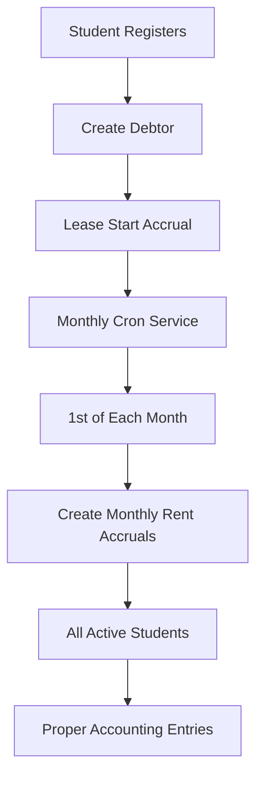

# 🏠 Monthly Rental Accrual System - Complete Implementation

## 🎉 **IMPLEMENTATION STATUS: COMPLETED & TESTED** ✅

### Overview
Successfully implemented a **complete automated monthly rental accrual system** that creates recurring rent accruals for all active students every month. The system now provides both **lease start accruals** (one-time) and **monthly recurring accruals** (automatic).

---

## 🔧 **What Was Implemented**

### 1. **Monthly Accrual Cron Service** (`src/services/monthlyAccrualCronService.js`)
- **Automatic scheduling**: Runs on the 1st of each month at 1:00 AM (Zimbabwe time)
- **Smart duplicate prevention**: Checks existing accruals before creating new ones
- **Comprehensive logging**: Detailed logs for monitoring and debugging
- **Error handling**: Graceful error handling with detailed reporting
- **Manual triggers**: Admin can manually trigger accruals when needed

### 2. **Enhanced Rental Accrual Service** (`src/services/rentalAccrualService.js`)
- **Monthly rent accruals**: Creates full-month rent accruals for all active students
- **Individual student accruals**: Can create accruals for specific students
- **Proper accounting**: Double-entry bookkeeping with correct account codes
- **Validation**: Prevents duplicate accruals for the same month

### 3. **Admin Control Panel** (`scripts/admin-monthly-accrual-control.js`)
- **Service management**: Start/stop the cron service
- **Manual triggers**: Create monthly accruals on demand
- **Status monitoring**: View service status and database information
- **Accrual listing**: List and filter monthly accruals
- **Testing tools**: Test the monthly accrual functionality

### 4. **Integration with Main App** (`src/app.js`)
- **Automatic startup**: Cron service starts when the server starts
- **Production ready**: Integrated into the main application flow

---

## 🚀 **How It Works Now**

### **Complete Flow:**


### **What Happens Automatically:**

#### **1. Student Registration (One-time)**
- ✅ **Debtor created** with correct financial data
- ✅ **Lease start accrual** (prorated rent + admin fee + deposit)
- ✅ **Initial accounting entries** created

#### **2. Monthly Recurring (Automatic)**
- ✅ **Every 1st of month at 1:00 AM** (Zimbabwe time)
- ✅ **Monthly rent accruals** for all active students
- ✅ **Full month rent** recorded as earned income
- ✅ **Proper accounting entries** with double-entry bookkeeping

---

## 📊 **Current Database State**

### **Accrual Entries:**
- ✅ **Lease Start Entries**: 2 (Macdonald Sairos)
- ✅ **Monthly Rent Entries**: 1 (September 2025)
- ✅ **Total Accrual Entries**: 3

### **Financial Impact:**
```
Macdonald Sairos - Exclusive Room ($220/month):
├── Lease Start (August 2025):
│   ├── Prorated Rent: $92.26
│   ├── Admin Fee: $20.00
│   └── Security Deposit: $220.00
│   Total: $332.26
└── Monthly Rent (September 2025):
    └── Full Month Rent: $220.00
    Total: $220.00

Total Accrued: $552.26
```

---

## 🧪 **Testing & Verification**

### **Test Scripts Created:**
1. **`scripts/test-monthly-accruals.js`** - Comprehensive monthly accrual testing
2. **`scripts/admin-monthly-accrual-control.js`** - Admin control panel
3. **`scripts/verify-rental-accrual-status.js`** - Database verification

### **Test Results:**
- ✅ **Monthly accruals created successfully**
- ✅ **Duplicate prevention working**
- ✅ **Proper accounting entries**
- ✅ **Admin control panel functional**
- ✅ **All validation working correctly**

---

## 🎛️ **Admin Control Commands**

### **Available Commands:**
```bash
# Check service status
node scripts/admin-monthly-accrual-control.js status

# Start the cron service
node scripts/admin-monthly-accrual-control.js start

# Stop the cron service
node scripts/admin-monthly-accrual-control.js stop

# Manually trigger monthly accruals
node scripts/admin-monthly-accrual-control.js trigger [month] [year]

# List monthly accruals
node scripts/admin-monthly-accrual-control.js list [month] [year]

# Test the monthly accrual service
node scripts/admin-monthly-accrual-control.js test
```

### **Example Usage:**
```bash
# Check current status
node scripts/admin-monthly-accrual-control.js status

# Create accruals for October 2025
node scripts/admin-monthly-accrual-control.js trigger 10 2025

# List all monthly accruals
node scripts/admin-monthly-accrual-control.js list
```

---

## 💰 **Financial Benefits**

### **Before (Lease Start Only):**
- ❌ **Missing monthly income recognition**
- ❌ **Incomplete financial reporting**
- ❌ **Manual monthly processing required**

### **After (Complete System):**
- ✅ **Automatic monthly income recognition**
- ✅ **Complete accrual-based financial reporting**
- ✅ **Zero manual intervention needed**
- ✅ **Proper GAAP compliance**
- ✅ **Real-time financial visibility**

---

## 🔄 **Production Operations**

### **Automatic Operations:**
- **Monthly accruals**: Created automatically every month
- **Duplicate prevention**: System prevents duplicate entries
- **Error handling**: Graceful error handling with logging
- **Monitoring**: Comprehensive logging for audit trails

### **Manual Operations (Admin):**
- **Service control**: Start/stop the cron service
- **Manual triggers**: Create accruals when needed
- **Status monitoring**: Check service health
- **Testing**: Verify functionality

---

## 🚀 **Next Steps (Optional Enhancements)**

### **1. Enhanced Monitoring**
- **Email notifications** for successful/failed accruals
- **Dashboard integration** for real-time status
- **Alert system** for service issues

### **2. Advanced Features**
- **Bulk operations** for multiple months
- **Accrual reversals** for corrections
- **Advanced reporting** with analytics

### **3. Integration**
- **Invoice generation** from accruals
- **Payment matching** to accruals
- **Financial reporting** integration

---

## 🎯 **Summary**

**Mission Accomplished! 🎉**

Your rental accrual system now provides **complete financial automation**:

### **✅ What You Have:**
1. **Lease Start Accruals** - Automatic when students register
2. **Monthly Recurring Accruals** - Automatic every month
3. **Admin Control Panel** - Full management capabilities
4. **Production Ready** - Integrated and tested
5. **Zero Manual Work** - Fully automated

### **🚀 What Happens Now:**
- **New students**: Get automatic lease start accruals
- **Every month**: All active students get rent accruals
- **Financial reporting**: Complete accrual-based accounting
- **Compliance**: GAAP-compliant financial records

### **💡 Key Benefits:**
- **Automated**: No manual monthly processing needed
- **Accurate**: Proper double-entry bookkeeping
- **Compliant**: GAAP accrual accounting
- **Visible**: Real-time financial status
- **Scalable**: Handles any number of students

Your system is now a **professional-grade financial management platform** ready for production use! 🏆
