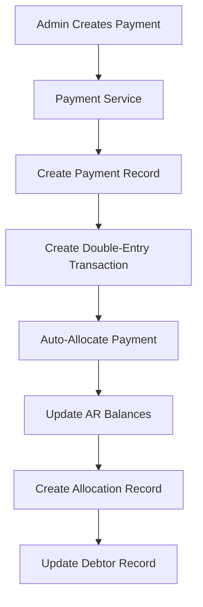
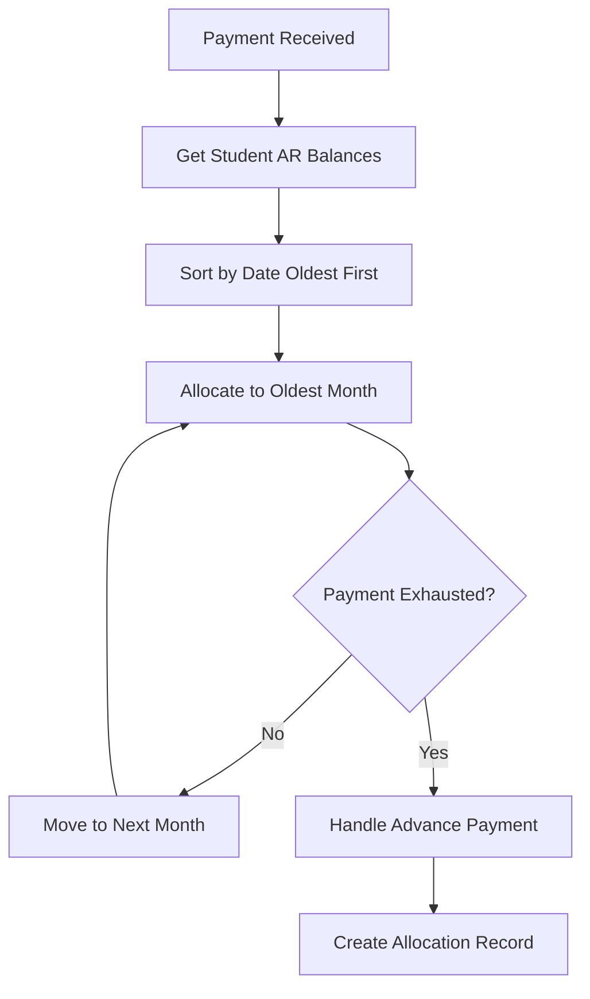

# Payment Allocation System Guide

## Overview

The Payment Allocation System is a FIFO (First In, First Out) based system that automatically allocates student payments to the oldest outstanding balances first. This ensures that students' accounts are settled in chronological order, maintaining proper accounting principles and cash flow management.

## Key Features

### 🎯 FIFO Principle
- **First In, First Out**: Payments are automatically allocated to the oldest outstanding balances first
- **Chronological Settlement**: Ensures proper debt settlement order
- **Balance Sheet Integrity**: Maintains double-entry accounting principles

### 💰 Automatic Allocation
- **Real-time Processing**: Payments are automatically allocated when created
- **Smart Month Detection**: Automatically detects the oldest AR accrual month
- **Advance Payment Handling**: Excess amounts are treated as advance payments

### 📊 Comprehensive Tracking
- **Monthly Breakdown**: Detailed allocation by month
- **Payment History**: Complete audit trail of all allocations
- **Balance Verification**: Ensures balance sheet always balances

## System Architecture

### Core Components

1. **PaymentAllocationService** (`src/services/paymentAllocationService.js`)
   - Main service handling all allocation logic
   - FIFO-based allocation algorithm
   - AR balance calculation and management

2. **PaymentAllocationController** (`src/controllers/admin/paymentAllocationController.js`)
   - REST API endpoints for allocation management
   - Manual and automatic allocation controls
   - Reporting and analytics

3. **PaymentAllocationRoutes** (`src/routes/admin/paymentAllocationRoutes.js`)
   - API routes for the allocation system
   - Role-based access control
   - Validation middleware

### Integration Points

- **Payment Service**: Automatically triggers allocation when payments are created
- **Double-Entry Accounting**: Creates proper accounting transactions
- **Debtor Management**: Updates debtor records with allocation details

## How It Works

### 1. Payment Creation Flow



### 2. FIFO Allocation Process



### 3. Example Scenario

**Student Lease Details:**
- **Period**: May 15 - September 29, 2024
- **Monthly Rent**: $180
- **Admin Fee**: $20 (first month only)
- **Deposit**: $180
- **First Month**: Prorated (May 15-31 = 17 days)

**Payment Made**: $380 ($180 rent + $20 admin + $180 deposit)

**Allocation Result:**
1. **May**: $118.71 (prorated rent + admin fee) - **FULLY PAID**
2. **June**: $180.00 - **FULLY PAID**
3. **July**: $81.29 (remaining amount) - **PARTIALLY PAID**
4. **August**: $0.00 - **UNPAID**
5. **September**: $0.00 - **UNPAID**

## API Endpoints

### Student-Specific Endpoints

#### Get Student AR Balances
```http
GET /api/admin/payment-allocation/student/:studentId/ar-balances
```

**Response:**
```json
{
  "success": true,
  "data": {
    "studentId": "student_id",
    "totalBalance": 900.00,
    "monthlyBalances": [
      {
        "monthKey": "2024-05",
        "balance": 118.71,
        "originalDebt": 118.71,
        "paidAmount": 0,
        "transactionId": "transaction_id"
      }
    ],
    "summary": {
      "monthsWithBalance": 5,
      "totalOwing": 900.00,
      "oldestBalance": "2024-05"
    }
  }
}
```

#### Get Payment Allocation Summary
```http
GET /api/admin/payment-allocation/student/:studentId/summary
```

#### Get Payment Allocation History
```http
GET /api/admin/payment-allocation/student/:studentId/history
```

#### Get Payment Coverage Analysis
```http
GET /api/admin/payment-allocation/student/:studentId/coverage
```

### Payment Allocation Endpoints

#### Auto-Allocate Payment
```http
POST /api/admin/payment-allocation/payment/:paymentId/auto-allocate
```

**Response:**
```json
{
  "success": true,
  "data": {
    "allocation": {
      "monthlyBreakdown": [
        {
          "month": "2024-05",
          "amountAllocated": 118.71,
          "allocationType": "debt_settlement"
        }
      ],
      "summary": {
        "totalAllocated": 380.00,
        "monthsCovered": 2,
        "advancePaymentAmount": 0,
        "allocationMethod": "FIFO (First In, First Out)"
      }
    }
  }
}
```

#### Manual Allocation
```http
POST /api/admin/payment-allocation/payment/manual-allocate
```

**Request Body:**
```json
{
  "paymentId": "payment_id",
  "allocations": [
    {
      "monthKey": "2024-05",
      "amount": 118.71,
      "transactionId": "transaction_id"
    }
  ]
}
```

### Admin Dashboard Endpoints

#### Get Students with Outstanding Balances
```http
GET /api/admin/payment-allocation/students/outstanding-balances?residence=residence_id&limit=100&sortBy=totalBalance&sortOrder=desc
```

#### Get Payment Allocation Analytics
```http
GET /api/admin/payment-allocation/analytics?startDate=2024-01-01&endDate=2024-12-31&residence=residence_id
```

### Bulk Operations

#### Bulk Auto-Allocation
```http
POST /api/admin/payment-allocation/bulk/auto-allocate
```

**Request Body:**
```json
{
  "paymentIds": ["payment_id_1", "payment_id_2", "payment_id_3"]
}
```

## Database Schema

### TransactionEntry Model
The system uses the existing `TransactionEntry` model with enhanced metadata:

```javascript
{
  transactionId: String,
  date: Date,
  description: String,
  entries: [
    {
      accountCode: String, // e.g., "1100-2024-05-student_id"
      accountName: String,
      accountType: String,
      debit: Number,
      credit: Number,
      description: String
    }
  ],
  totalDebit: Number,
  totalCredit: Number,
  source: String, // "payment", "manual", "rental_accrual"
  metadata: {
    studentId: String,
    monthKey: String, // "YYYY-MM"
    paymentAllocation: {
      paymentId: String,
      amount: Number,
      date: Date,
      allocatedBy: String
    }
  }
}
```

### Payment Model
Enhanced with allocation tracking:

```javascript
{
  paymentId: String,
  student: ObjectId,
  user: ObjectId,
  totalAmount: Number,
  paymentMonth: String, // "YYYY-MM"
  // ... other fields
  metadata: {
    monthOverride: {
      original: String,
      effective: String,
      reason: String,
      correctedAt: Date
    }
  }
}
```

## Configuration

### Environment Variables
```bash
# MongoDB Connection
MONGODB_URI=mongodb://localhost:27017/alamait

# Payment Allocation Settings
PAYMENT_ALLOCATION_ENABLED=true
AUTO_ALLOCATION_ENABLED=true
FIFO_ALLOCATION_ENABLED=true
```

### Role-Based Access Control
The following roles can access payment allocation features:
- `admin`
- `finance_admin`
- `finance_user`

## Testing

### Run the Test Script
```bash
node test-payment-allocation-system.js
```

This script demonstrates:
1. Creating test student and residence
2. Setting up lease accruals
3. Creating a payment
4. Auto-allocating the payment
5. Verifying balance sheet balance
6. Cleaning up test data

### Manual Testing
```bash
# Test AR balances endpoint
curl -X GET "http://localhost:5000/api/admin/payment-allocation/student/student_id/ar-balances" \
  -H "Authorization: Bearer your_token"

# Test auto-allocation
curl -X POST "http://localhost:5000/api/admin/payment-allocation/payment/payment_id/auto-allocate" \
  -H "Authorization: Bearer your_token"
```

## Error Handling

### Common Error Scenarios

1. **No AR Balances Found**
   ```json
   {
     "success": false,
     "error": "No accounts receivable found for this student",
     "message": "Cannot allocate payment - no outstanding balances"
   }
   ```

2. **Payment Amount Mismatch**
   ```json
   {
     "success": false,
     "error": "Total allocation amount must match payment amount"
   }
   ```

3. **Insufficient AR Balance**
   ```json
   {
     "success": false,
     "error": "Payment allocation exceeds AR balance"
   }
   ```

### Error Recovery

1. **Manual Allocation**: If auto-allocation fails, use manual allocation
2. **Payment Adjustment**: Modify payment amounts if needed
3. **AR Correction**: Create missing AR transactions if needed

## Best Practices

### For Administrators

1. **Regular Monitoring**: Check outstanding balances regularly
2. **Payment Verification**: Verify payment amounts before allocation
3. **Manual Review**: Review allocation results for large payments
4. **Audit Trail**: Keep records of all allocation decisions

### For Developers

1. **Error Handling**: Always handle allocation failures gracefully
2. **Transaction Safety**: Use database transactions for allocation operations
3. **Validation**: Validate all input data before processing
4. **Logging**: Log all allocation activities for audit purposes

## Troubleshooting

### Common Issues

1. **Payment Not Allocated**
   - Check if student has AR balances
   - Verify payment amount is positive
   - Check database connectivity

2. **Balance Sheet Imbalance**
   - Verify all transactions are properly recorded
   - Check for missing AR accruals
   - Review allocation calculations

3. **Performance Issues**
   - Index AR account codes for faster queries
   - Limit batch allocation sizes
   - Monitor database performance

### Debug Commands

```javascript
// Check student AR balances
const balances = await PaymentAllocationService.getStudentARBalances(studentId);
console.log('AR Balances:', balances);

// Check payment allocation history
const history = await PaymentAllocationService.getStudentPaymentCoverage(studentId);
console.log('Payment History:', history);

// Verify balance sheet
const transactions = await TransactionEntry.find({
  'entries.accountCode': { $regex: `^1100-${studentId}` }
});
```

## Future Enhancements

### Planned Features

1. **Advanced Allocation Rules**
   - Custom allocation priorities
   - Partial month handling
   - Special fee allocation

2. **Reporting Enhancements**
   - Real-time allocation dashboard
   - Predictive cash flow analysis
   - Automated reconciliation reports

3. **Integration Improvements**
   - Bank statement reconciliation
   - Automated payment processing
   - Multi-currency support

### API Versioning

Future versions will maintain backward compatibility while adding new features:

```http
GET /api/v2/admin/payment-allocation/student/:studentId/ar-balances
```

## Support

For technical support or questions about the Payment Allocation System:

1. **Documentation**: Check this guide and inline code comments
2. **Logs**: Review application logs for detailed error information
3. **Testing**: Use the provided test scripts to verify functionality
4. **Development**: Contact the development team for custom modifications

---

**Version**: 1.0.0  
**Last Updated**: December 2024  
**Maintainer**: Alamait Development Team

