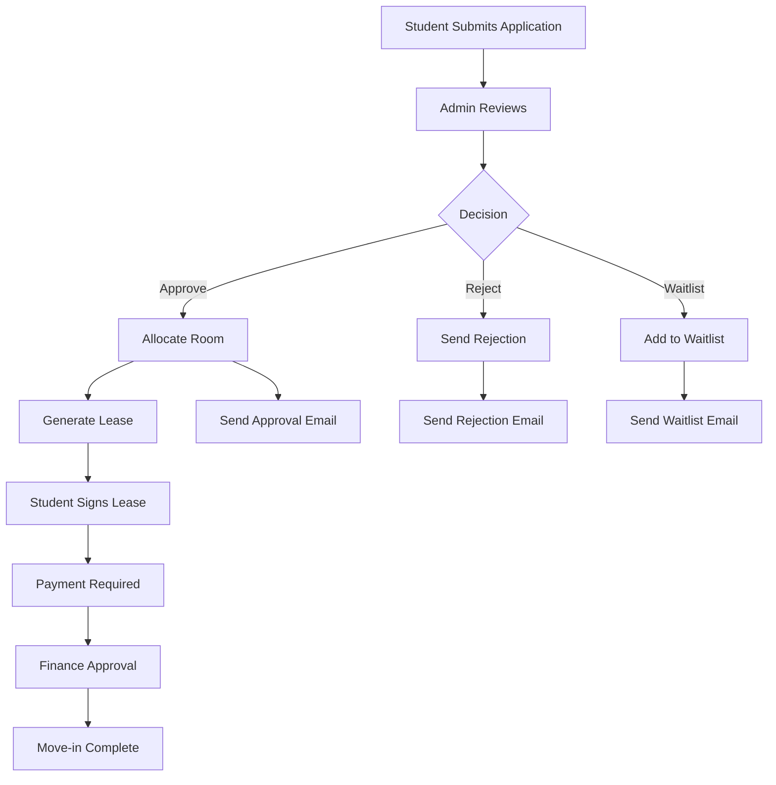

# 🏢 **Admin Request Handling Guide**

## 📋 **Overview**

This guide covers how administrators handle different types of requests in the Alamait Student Accommodation system. Admins have comprehensive control over maintenance requests, student applications, payments, and financial transactions.

## 🎯 **Admin Capabilities**

### **1. Request Types Handled**
- ✅ **Maintenance Requests** - Create, update, assign, track
- ✅ **Student Applications** - Approve, reject, waitlist
- ✅ **Payment Management** - Track, update status, create payments
- ✅ **Financial Transactions** - View, monitor, analyze
- ✅ **Audit Logs** - Track all system activities

### **2. Admin Roles & Permissions**
- **Admin** - Full system access
- **Finance Admin** - Financial operations + admin capabilities
- **Finance User** - Limited financial operations
- **CEO** - Executive oversight + admin capabilities

## 🔧 **Maintenance Request Handling**

### **1. View All Maintenance Requests**
```javascript
GET /api/admin/maintenance
```

**Query Parameters:**
- `status` - Filter by status (pending, assigned, in-progress, completed)
- `priority` - Filter by priority (low, medium, high)
- `search` - Search by title, description, location
- `page` - Pagination page number
- `limit` - Results per page
- `financeStatus` - Filter by finance approval status

**Response:**
```javascript
{
    "requests": [
        {
            "_id": "...",
            "issue": "Plumbing Leak",
            "description": "Water leaking from bathroom sink",
            "room": "A101",
            "status": "pending",
            "priority": "high",
            "amount": 150,
            "financeStatus": "pending",
            "assignedTo": {
                "_id": "...",
                "name": "John",
                "surname": "Doe"
            },
            "residence": "St. Kilda Residence",
            "requestHistory": [...]
        }
    ],
    "currentPage": 1,
    "totalPages": 5,
    "total": 50
}
```

### **2. Create Maintenance Request**
```javascript
POST /api/admin/maintenance
```

**Request Body:**
```javascript
{
    "issue": "Electrical Issue",
    "description": "Power outlet not working in room",
    "room": "B205",
    "residence": "residence_id",
    "priority": "medium",
    "status": "pending",
    "amount": 200,
    "assignedTo": "staff_id",
    "estimatedCompletion": "2025-01-15"
}
```

### **3. Update Maintenance Request**
```javascript
PUT /api/admin/maintenance/:requestId
```

**Updateable Fields:**
- `status` - pending, assigned, in-progress, on-hold, completed
- `assignedTo` - Staff member ID
- `priority` - low, medium, high
- `category` - plumbing, electrical, hvac, appliance, structural, other
- `description` - Updated description
- `amount` - Cost amount
- `financeStatus` - pending, approved, rejected
- `comment` - Admin notes

**Request Body:**
```javascript
{
    "status": "assigned",
    "assignedTo": "staff_id",
    "priority": "high",
    "amount": 300,
    "comment": "Assigned to maintenance team"
}
```

### **4. Assign Maintenance Request**
```javascript
POST /api/admin/maintenance/:requestId/assign
```

**Request Body:**
```javascript
{
    "assignedTo": "staff_id",
    "estimatedCompletion": "2025-01-20"
}
```

### **5. Maintenance Dashboard Stats**
```javascript
GET /api/admin/dashboard/maintenance
```

**Response:**
```javascript
{
    "openRequests": 15,
    "highPriorityCount": 5,
    "inProgressCount": 8,
    "completedToday": 3
}
```

## 📝 **Student Application Handling**

### **1. View All Applications**
```javascript
GET /api/admin/applications
```

**Query Parameters:**
- `status` - Filter by status (pending, approved, rejected, waitlisted)
- `requestType` - Filter by type (new, upgrade, transfer)
- `residence` - Filter by residence
- `page` - Pagination
- `limit` - Results per page

### **2. Update Application Status**
```javascript
PUT /api/admin/applications/:applicationId
```

**Available Actions:**

#### **Approve Application**
```javascript
{
    "action": "approve",
    "roomNumber": "A101",
    "residenceId": "residence_id"
}
```

**What happens:**
- ✅ Application status → `approved`
- ✅ Room allocated to student
- ✅ Room occupancy updated
- ✅ Student's current room updated
- ✅ Application code generated
- ✅ Lease agreement sent
- ✅ Email notification sent

#### **Reject Application**
```javascript
{
    "action": "reject"
}
```

**What happens:**
- ❌ Application status → `rejected`
- ❌ Rejection email sent to student
- ❌ No room allocation

#### **Waitlist Application**
```javascript
{
    "action": "waitlist",
    "roomNumber": "A101"
}
```

**What happens:**
- ⏳ Application status → `waitlisted`
- ⏳ Room number recorded
- ⏳ Student added to waitlist
- ⏳ Waitlist email sent

### **3. Application Workflow**



## 💰 **Payment Management**

### **1. View All Payments**
```javascript
GET /api/admin/payments
```

**Query Parameters:**
- `status` - Filter by status (pending, completed, failed)
- `method` - Filter by payment method
- `dateRange` - Filter by date range
- `student` - Filter by student

### **2. Update Payment Status**
```javascript
PUT /api/admin/payments/:paymentId
```

**Request Body:**
```javascript
{
    "status": "completed",
    "amount": 500,
    "method": "bank_transfer"
}
```

### **3. Create Payment**
```javascript
POST /api/admin/payments
```

**Request Body:**
```javascript
{
    "amount": 500,
    "method": "cash",
    "status": "completed",
    "description": "Room payment for January",
    "studentId": "student_id"
}
```

## 📊 **Financial Transaction Monitoring**

### **1. View All Transactions**
```javascript
GET /api/admin/dashboard/transactions
```

**Query Parameters:**
- `type` - Filter by transaction type
- `startDate` - Filter from date
- `endDate` - Filter to date
- `residence` - Filter by residence

### **2. Financial Dashboard Stats**
```javascript
GET /api/admin/dashboard/financial
```

**Response:**
```javascript
{
    "totalRevenue": 50000,
    "pendingPayments": 15000,
    "overduePayments": 5000,
    "monthlyRevenue": [...],
    "paymentMethods": {...}
}
```

### **3. Export Transactions**
```javascript
POST /api/admin/dashboard/export-transactions
```

**Request Body:**
```javascript
{
    "startDate": "2025-01-01",
    "endDate": "2025-01-31",
    "format": "csv"
}
```

## 🔍 **Audit Log Management**

### **1. View Audit Logs**
```javascript
GET /api/admin/audit-log
```

**Query Parameters:**
- `action` - Filter by action type
- `user` - Filter by user
- `dateRange` - Filter by date range
- `module` - Filter by system module

### **2. Audit Log Features**
- ✅ **Track all admin actions**
- ✅ **User activity monitoring**
- ✅ **System changes logging**
- ✅ **Security event tracking**
- ✅ **Compliance reporting**

## 🎛️ **Admin Dashboard Overview**

### **1. Main Dashboard Stats**
```javascript
GET /api/admin/dashboard/stats
```

**Response:**
```javascript
{
    "totalStudents": 150,
    "totalResidences": 5,
    "totalRooms": 200,
    "occupancyRate": 85,
    "pendingApplications": 12,
    "openMaintenanceRequests": 8,
    "totalRevenue": 75000
}
```

### **2. Occupancy Stats**
```javascript
GET /api/admin/dashboard/occupancy
```

**Response:**
```javascript
{
    "residences": [
        {
            "name": "St. Kilda Residence",
            "totalRooms": 50,
            "occupiedRooms": 45,
            "occupancyRate": 90
        }
    ],
    "overallOccupancy": 85
}
```

## 🔄 **Request Status Workflows**

### **1. Maintenance Request Status Flow**
```
pending → assigned → in-progress → completed
   ↓         ↓           ↓           ↓
[Admin]  [Admin]    [Staff]     [Admin]
Review   Assign     Work        Verify
```

### **2. Application Status Flow**
```
pending → approved → lease_signed → payment_paid → active
   ↓         ↓           ↓            ↓           ↓
[Admin]  [Admin]    [Student]     [Finance]   [System]
Review   Approve    Sign Lease    Process     Activate
```

### **3. Payment Status Flow**
```
pending → processing → completed
   ↓         ↓           ↓
[Admin]  [System]     [Admin]
Create   Process      Verify
```

## 📱 **Admin Interface Features**

### **1. Real-time Updates**
- ✅ **Live status updates**
- ✅ **Instant notifications**
- ✅ **Real-time dashboard**
- ✅ **Auto-refresh data**

### **2. Bulk Operations**
- ✅ **Bulk application approval**
- ✅ **Bulk payment processing**
- ✅ **Bulk maintenance assignment**
- ✅ **Bulk status updates**

### **3. Advanced Filtering**
- ✅ **Multi-criteria search**
- ✅ **Date range filtering**
- ✅ **Status-based filtering**
- ✅ **Residence-based filtering**

### **4. Export & Reporting**
- ✅ **CSV/Excel export**
- ✅ **PDF reports**
- ✅ **Custom date ranges**
- ✅ **Automated reports**

## 🚨 **Emergency Procedures**

### **1. High Priority Maintenance**
- ✅ **Immediate assignment**
- ✅ **Priority escalation**
- ✅ **Staff notification**
- ✅ **Progress tracking**

### **2. Payment Issues**
- ✅ **Payment verification**
- ✅ **Manual override**
- ✅ **Refund processing**
- ✅ **Dispute resolution**

### **3. System Issues**
- ✅ **Emergency access**
- ✅ **Manual processing**
- ✅ **Backup procedures**
- ✅ **Recovery protocols**

## 📞 **Support & Escalation**

### **1. When to Escalate**
- 🔴 **System errors**
- 🔴 **Payment disputes**
- 🔴 **Legal issues**
- 🔴 **Security concerns**

### **2. Escalation Path**
```
Admin → Finance Admin → CEO → External Support
```

### **3. Contact Information**
- **Technical Support**: tech@alamait.com
- **Finance Support**: finance@alamait.com
- **Emergency**: +1234567890

## ✅ **Best Practices**

### **1. Request Handling**
- ✅ **Review all details before approval**
- ✅ **Verify room availability**
- ✅ **Check student eligibility**
- ✅ **Document all decisions**

### **2. Communication**
- ✅ **Clear status updates**
- ✅ **Timely notifications**
- ✅ **Professional responses**
- ✅ **Follow-up procedures**

### **3. Security**
- ✅ **Verify user permissions**
- ✅ **Log all actions**
- ✅ **Protect sensitive data**
- ✅ **Regular access reviews**

## 🎯 **Quick Reference**

### **Common Admin Actions**
| Action | Endpoint | Method |
|--------|----------|--------|
| View Maintenance | `/api/admin/maintenance` | GET |
| Update Maintenance | `/api/admin/maintenance/:id` | PUT |
| View Applications | `/api/admin/applications` | GET |
| Approve Application | `/api/admin/applications/:id` | PUT |
| View Payments | `/api/admin/payments` | GET |
| Update Payment | `/api/admin/payments/:id` | PUT |
| Dashboard Stats | `/api/admin/dashboard/stats` | GET |

### **Status Codes**
| Status | Meaning | Action Required |
|--------|---------|-----------------|
| `pending` | Awaiting review | Admin review |
| `assigned` | Staff assigned | Monitor progress |
| `in-progress` | Work ongoing | Track completion |
| `completed` | Work finished | Verify quality |
| `approved` | Application approved | Process payment |
| `rejected` | Application denied | Send notification |

This comprehensive guide ensures admins can effectively handle all types of requests in the system! 🚀 