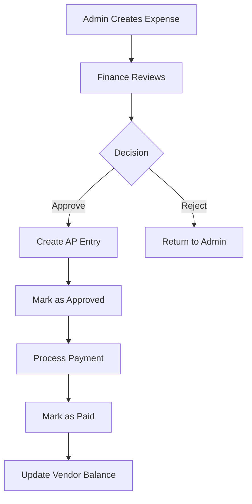
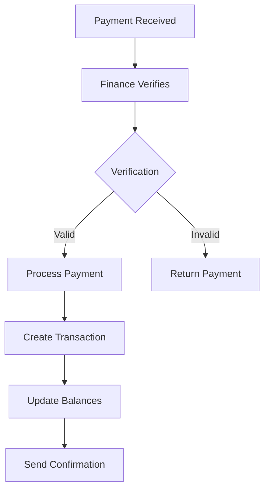
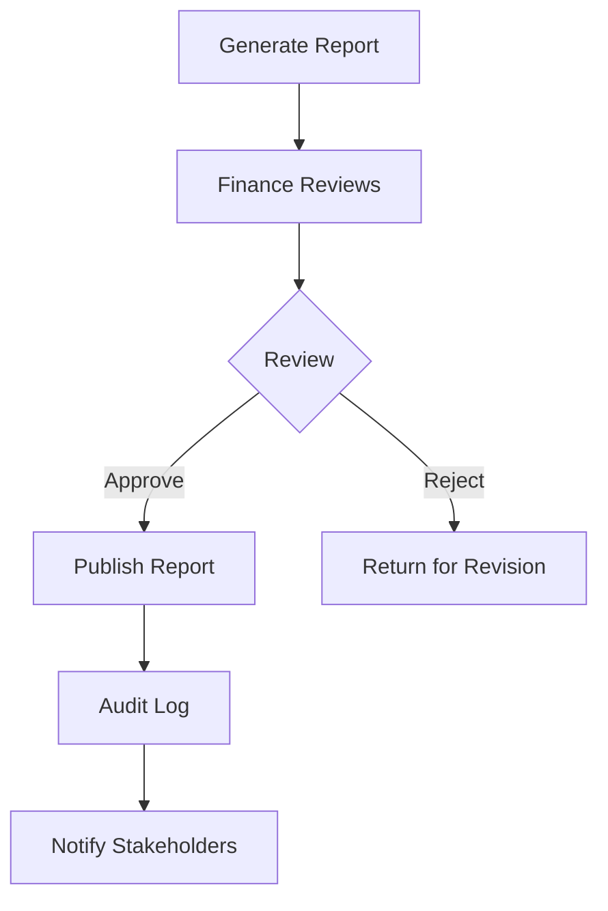

# 💰 **Finance Request Handling Guide**

## 📋 **Overview**

This guide covers how Finance handles different types of requests in the Alamait Student Accommodation system. Finance has comprehensive control over expense approvals, payment processing, financial reporting, and transaction management.

## 🎯 **Finance Capabilities**

### **1. Request Types Handled**
- ✅ **Expense Management** - Review, approve, mark as paid
- ✅ **Payment Processing** - Student payments, vendor payments
- ✅ **Financial Reporting** - Balance sheets, income statements
- ✅ **Transaction Management** - Double-entry bookkeeping
- ✅ **Vendor Management** - Vendor accounts and payments
- ✅ **Audit & Compliance** - Financial audit trails

### **2. Finance Roles & Permissions**
- **Finance Admin** - Full financial operations + admin capabilities
- **Finance User** - Limited financial operations (view, process payments)
- **Admin** - Financial operations + admin capabilities
- **CEO** - Financial oversight + executive capabilities

## 💸 **Expense Request Handling**

### **1. View All Expenses**
```javascript
GET /api/finance/expenses
```

**Query Parameters:**
- `residence` - Filter by residence ID
- `category` - Filter by expense category
- `startDate` - Filter from date (YYYY-MM-DD)
- `endDate` - Filter to date (YYYY-MM-DD)
- `paymentStatus` - Filter by status (Pending, Approved, Paid)
- `page` - Pagination page number
- `limit` - Results per page
- `sortBy` - Sort field (expenseDate, amount, category)
- `sortOrder` - Sort order (asc, desc)

**Response:**
```javascript
{
    "expenses": [
        {
            "_id": "...",
            "expenseId": "EXP-2025-001",
            "description": "Plumbing repair - Room A101",
            "category": "Maintenance",
            "amount": 500,
            "paymentStatus": "Pending",
            "expenseDate": "2025-01-15T10:30:00.000Z",
            "residence": {
                "_id": "...",
                "name": "St. Kilda Residence"
            },
            "createdBy": {
                "_id": "...",
                "firstName": "John",
                "lastName": "Admin"
            }
        }
    ],
    "pagination": {
        "currentPage": 1,
        "totalPages": 5,
        "total": 50
    }
}
```

### **2. Get Expense by ID**
```javascript
GET /api/finance/expenses/:id
```

**Response:**
```javascript
{
    "expense": {
        "_id": "...",
        "expenseId": "EXP-2025-001",
        "description": "Plumbing repair - Room A101",
        "category": "Maintenance",
        "amount": 500,
        "paymentStatus": "Pending",
        "expenseDate": "2025-01-15T10:30:00.000Z",
        "paymentMethod": "Bank Transfer",
        "notes": "Emergency repair required",
        "residence": {
            "_id": "...",
            "name": "St. Kilda Residence"
        },
        "createdBy": {
            "_id": "...",
            "firstName": "John",
            "lastName": "Admin"
        }
    }
}
```

### **3. Approve Expense**
```javascript
PATCH /api/finance/expenses/:id/approve
```

**Request Body:**
```javascript
{
    "notes": "Approved after vendor verification"
}
```

**What happens when approved:**
- ✅ **Expense status** → `Approved`
- ✅ **Accounts Payable entry** created (double-entry)
- ✅ **Transaction entries** created:
  - **Debit**: Expense Account (e.g., Maintenance Expense)
  - **Credit**: Accounts Payable (Liability)
- ✅ **Audit log** created
- ✅ **Email notification** sent

**Response:**
```javascript
{
    "message": "Expense approved successfully",
    "expense": {
        "paymentStatus": "Approved",
        "updatedBy": "finance_user_id",
        "notes": "Approved after vendor verification"
    }
}
```

### **4. Mark Expense as Paid**
```javascript
PATCH /api/finance/expenses/:id/mark-paid
```

**Request Body:**
```javascript
{
    "paymentMethod": "Bank Transfer",
    "notes": "Payment processed via bank transfer",
    "paidDate": "2025-01-16T14:30:00.000Z"
}
```

**What happens when marked as paid:**
- ✅ **Expense status** → `Paid`
- ✅ **Payment transaction** created (double-entry)
- ✅ **Transaction entries** created:
  - **Debit**: Accounts Payable (Liability)
  - **Credit**: Bank Account (Asset)
- ✅ **Vendor balance** updated
- ✅ **Audit log** created

**Response:**
```javascript
{
    "message": "Expense marked as paid successfully",
    "expense": {
        "paymentStatus": "Paid",
        "paidDate": "2025-01-16T14:30:00.000Z",
        "paymentMethod": "Bank Transfer"
    }
}
```

### **5. Expense Summary Statistics**
```javascript
GET /api/finance/expenses/summary/summary
```

**Query Parameters:**
- `residence` - Filter by residence
- `startDate` - Filter from date
- `endDate` - Filter to date

**Response:**
```javascript
{
    "summary": {
        "totalAmount": 25000,
        "byCategory": [
            {
                "category": "Maintenance",
                "amount": 15000,
                "percentage": 60
            },
            {
                "category": "Utilities",
                "amount": 10000,
                "percentage": 40
            }
        ],
        "byStatus": [
            {
                "status": "Paid",
                "amount": 20000,
                "count": 25,
                "percentage": 80
            },
            {
                "status": "Pending",
                "amount": 5000,
                "count": 5,
                "percentage": 20
            }
        ]
    }
}
```

## 💳 **Payment Processing**

### **1. View All Student Payments**
```javascript
GET /api/finance/payments
```

**Query Parameters:**
- `status` - Filter by payment status
- `residence` - Filter by residence
- `startDate` - Filter from date
- `endDate` - Filter to date
- `student` - Filter by student
- `paymentType` - Filter by payment type

**Response:**
```javascript
{
    "payments": [
        {
            "_id": "...",
            "amount": 500,
            "method": "Bank Transfer",
            "status": "completed",
            "date": "2025-01-15T10:30:00.000Z",
            "description": "Room payment for January",
            "student": {
                "_id": "...",
                "firstName": "Jane",
                "lastName": "Doe"
            },
            "residence": {
                "_id": "...",
                "name": "St. Kilda Residence"
            }
        }
    ]
}
```

### **2. Update Payment Status**
```javascript
PUT /api/finance/payments/:id
```

**Request Body:**
```javascript
{
    "status": "completed",
    "notes": "Payment verified and processed"
}
```

## 📊 **Financial Reporting**

### **1. Balance Sheet Management**
```javascript
GET /api/finance/balance-sheets
```

**Query Parameters:**
- `residence` - Filter by residence
- `status` - Filter by status (Draft, Published)
- `startDate` - Filter from date
- `endDate` - Filter to date

### **2. Approve Balance Sheet**
```javascript
PATCH /api/finance/balance-sheets/:id/approve
```

**Request Body:**
```javascript
{
    "notes": "Balance sheet reviewed and approved"
}
```

**What happens when approved:**
- ✅ **Status** → `Published`
- ✅ **Approved by** recorded
- ✅ **Approval date** recorded
- ✅ **Audit log** created

### **3. Income Statement Management**
```javascript
GET /api/finance/income-statements
```

### **4. Approve Income Statement**
```javascript
PATCH /api/finance/income-statements/:id/approve
```

## 🔄 **Transaction Management**

### **1. View All Transactions**
```javascript
GET /api/finance/transactions
```

**Query Parameters:**
- `type` - Filter by transaction type (approval, payment, adjustment)
- `startDate` - Filter from date
- `endDate` - Filter to date
- `residence` - Filter by residence
- `limit` - Number of results
- `page` - Page number

**Response:**
```javascript
{
    "transactions": [
        {
            "_id": "...",
            "transactionId": "TXN-2025-001",
            "date": "2025-01-15T10:30:00.000Z",
            "description": "Expense approval: Plumbing repair",
            "type": "approval",
            "amount": 500,
            "residence": {
                "_id": "...",
                "name": "St. Kilda Residence"
            }
        }
    ],
    "pagination": {
        "total": 25,
        "page": 1,
        "limit": 50,
        "pages": 1
    }
}
```

### **2. Get Transaction Summary**
```javascript
GET /api/finance/transactions/summary
```

**Response:**
```javascript
{
    "summary": {
        "totalTransactions": 25,
        "totalAmount": 12500,
        "byType": {
            "approval": {
                "count": 15,
                "amount": 7500
            },
            "payment": {
                "count": 10,
                "amount": 5000
            }
        },
        "byMonth": {
            "2025-01": {
                "count": 25,
                "amount": 12500
            }
        }
    }
}
```

### **3. Get Transaction Entries**
```javascript
GET /api/finance/transactions/transaction-entries
```

**Response:**
```javascript
{
    "entries": [
        {
            "_id": "...",
            "transaction": {
                "_id": "...",
                "transactionId": "TXN-2025-001",
                "description": "Expense approval: Plumbing repair"
            },
            "account": {
                "_id": "...",
                "code": "5003",
                "name": "Maintenance Expense",
                "type": "expense"
            },
            "debit": 500,
            "credit": 0,
            "description": "Plumbing repair expense"
        }
    ]
}
```

## 🏢 **Vendor Management**

### **1. View All Vendors**
```javascript
GET /api/finance/vendors
```

**Query Parameters:**
- `category` - Filter by vendor category
- `status` - Filter by vendor status
- `search` - Search by name or business name

### **2. Get Vendors for Quotations**
```javascript
GET /api/finance/vendors/for-quotations
```

**Response:**
```javascript
{
    "vendors": [
        {
            "_id": "...",
            "businessName": "ABC Plumbing Services",
            "category": "Maintenance",
            "contactPerson": "John Smith",
            "phone": "+1234567890",
            "email": "john@abcplumbing.com",
            "balance": 1500
        }
    ]
}
```

## 📈 **Financial Dashboard**

### **1. Finance Dashboard Stats**
```javascript
GET /api/finance/dashboard/stats
```

**Response:**
```javascript
{
    "totalExpenses": 25000,
    "pendingExpenses": 5000,
    "approvedExpenses": 15000,
    "paidExpenses": 20000,
    "totalRevenue": 75000,
    "pendingPayments": 10000,
    "overduePayments": 5000,
    "vendorBalances": 8000
}
```

### **2. Expense Analytics**
```javascript
GET /api/finance/expenses/analytics
```

**Response:**
```javascript
{
    "monthlyExpenses": [
        {
            "month": "2025-01",
            "amount": 25000,
            "count": 15
        }
    ],
    "categoryBreakdown": [
        {
            "category": "Maintenance",
            "amount": 15000,
            "percentage": 60
        }
    ],
    "paymentStatusBreakdown": [
        {
            "status": "Paid",
            "amount": 20000,
            "percentage": 80
        }
    ]
}
```

## 🔄 **Finance Request Workflows**

### **1. Expense Approval Workflow**


### **2. Payment Processing Workflow**


### **3. Financial Reporting Workflow**


## 📱 **Finance Interface Features**

### **1. Real-time Financial Data**
- ✅ **Live expense tracking**
- ✅ **Real-time payment status**
- ✅ **Instant balance updates**
- ✅ **Live transaction feeds**

### **2. Advanced Filtering & Search**
- ✅ **Multi-criteria expense filtering**
- ✅ **Date range filtering**
- ✅ **Category-based filtering**
- ✅ **Status-based filtering**

### **3. Bulk Operations**
- ✅ **Bulk expense approval**
- ✅ **Bulk payment processing**
- ✅ **Bulk status updates**
- ✅ **Bulk export operations**

### **4. Export & Reporting**
- ✅ **CSV/Excel export**
- ✅ **PDF financial reports**
- ✅ **Custom date ranges**
- ✅ **Automated reporting**

## 🚨 **Emergency Financial Procedures**

### **1. High-Priority Expenses**
- ✅ **Immediate approval process**
- ✅ **Priority escalation**
- ✅ **Emergency payment processing**
- ✅ **Vendor notification**

### **2. Payment Issues**
- ✅ **Payment verification**
- ✅ **Manual override**
- ✅ **Refund processing**
- ✅ **Dispute resolution**

### **3. System Issues**
- ✅ **Emergency access**
- ✅ **Manual processing**
- ✅ **Backup procedures**
- ✅ **Recovery protocols**

## 📞 **Support & Escalation**

### **1. When to Escalate**
- 🔴 **Large expense amounts**
- 🔴 **Payment disputes**
- 🔴 **Vendor issues**
- 🔴 **System errors**

### **2. Escalation Path**
```
Finance User → Finance Admin → CEO → External Support
```

### **3. Contact Information**
- **Finance Support**: finance@alamait.com
- **Vendor Support**: vendors@alamait.com
- **Emergency**: +1234567890

## ✅ **Best Practices**

### **1. Expense Management**
- ✅ **Verify all expense details**
- ✅ **Check vendor credentials**
- ✅ **Review supporting documents**
- ✅ **Document all decisions**

### **2. Payment Processing**
- ✅ **Verify payment authenticity**
- ✅ **Check account balances**
- ✅ **Process payments promptly**
- ✅ **Maintain audit trail**

### **3. Financial Reporting**
- ✅ **Review all calculations**
- ✅ **Verify data accuracy**
- ✅ **Ensure compliance**
- ✅ **Document approvals**

## 🎯 **Quick Reference**

### **Common Finance Actions**
| Action | Endpoint | Method |
|--------|----------|--------|
| View Expenses | `/api/finance/expenses` | GET |
| Approve Expense | `/api/finance/expenses/:id/approve` | PATCH |
| Mark as Paid | `/api/finance/expenses/:id/mark-paid` | PATCH |
| View Payments | `/api/finance/payments` | GET |
| View Transactions | `/api/finance/transactions` | GET |
| View Vendors | `/api/finance/vendors` | GET |
| Expense Summary | `/api/finance/expenses/summary/summary` | GET |

### **Expense Status Codes**
| Status | Meaning | Action Required |
|--------|---------|-----------------|
| `Pending` | Awaiting review | Finance review |
| `Approved` | Finance approved | Process payment |
| `Paid` | Payment completed | Monitor vendor |

### **Payment Status Codes**
| Status | Meaning | Action Required |
|--------|---------|-----------------|
| `pending` | Awaiting processing | Verify payment |
| `processing` | Payment in progress | Monitor status |
| `completed` | Payment successful | Update records |
| `failed` | Payment failed | Investigate issue |

## 🔒 **Security & Compliance**

### **1. Financial Security**
- ✅ **Role-based access control**
- ✅ **Audit trail logging**
- ✅ **Data encryption**
- ✅ **Secure payment processing**

### **2. Compliance Requirements**
- ✅ **Financial reporting standards**
- ✅ **Tax compliance**
- ✅ **Audit requirements**
- ✅ **Data retention policies**

This comprehensive guide ensures finance can effectively handle all types of financial requests in the system! 🚀 