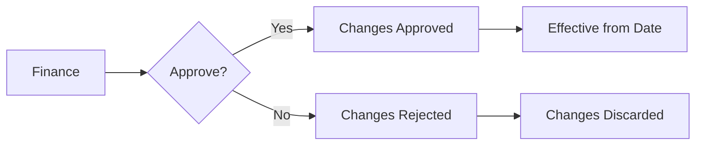
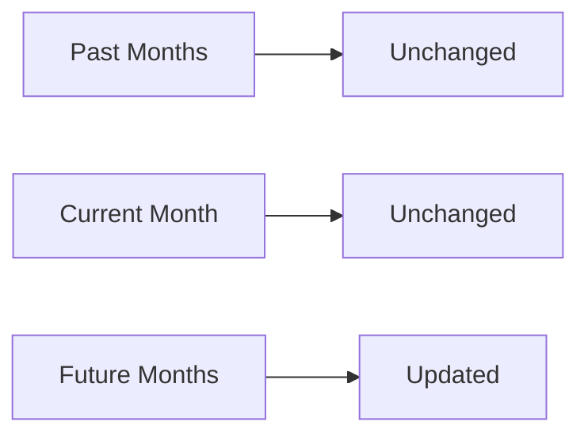

# 🛠️ Template Editing Guide

## 🎯 Overview

This guide covers all the available endpoints for editing monthly request templates, including individual item operations and full template updates.

## 📋 Available Template Editing Endpoints

### **1. Individual Item Operations (Admin Only)**

#### **A. Add New Item to Template**
```bash
POST /api/monthly-requests/templates/:templateId/items
```

**Request Body:**
```javascript
{
    "title": "New WiFi Service",
    "description": "High-speed WiFi for residents",
    "estimatedCost": 150,
    "quantity": 1,
    "category": "utilities",
    "priority": "medium",
    "isRecurring": true,
    "notes": "Monthly WiFi service"
}
```

**Response:**
```javascript
{
    "message": "Item added to template successfully. Changes will be effective from next month and require finance approval.",
    "template": { /* updated template */ },
    "addedItem": { /* added item details */ }
}
```

#### **B. Modify Specific Item in Template**
```bash
PUT /api/monthly-requests/templates/:templateId/items/:itemIndex
```

**Request Body:**
```javascript
{
    "field": "estimatedCost",
    "newValue": 200
}
```

**Available Fields:**
- `title` - Item title
- `description` - Item description
- `quantity` - Item quantity
- `estimatedCost` - Item cost
- `category` - Item category
- `priority` - Item priority
- `notes` - Item notes

**Response:**
```javascript
{
    "message": "Item modified successfully. Changes will be effective from next month and require finance approval.",
    "template": { /* updated template */ },
    "modifiedItem": {
        "index": 0,
        "field": "estimatedCost",
        "newValue": 200
    }
}
```

#### **C. Remove Item from Template**
```bash
DELETE /api/monthly-requests/templates/:templateId/items/:itemIndex
```

**Response:**
```javascript
{
    "message": "Item removed successfully. Changes will be effective from next month and require finance approval.",
    "template": { /* updated template */ },
    "removedItem": { /* removed item details */ }
}
```

### **2. Full Template Update (Admin Only)**

#### **A. Update Entire Template**
```bash
PUT /api/monthly-requests/templates/:templateId
```

**Request Body:**
```javascript
{
    "title": "Updated Monthly Services Template",
    "description": "Updated template description",
    "templateName": "St Kilda Updated Services",
    "templateDescription": "Updated recurring monthly services",
    
    // Optional: Update all items at once
    "items": [
        {
            "title": "WiFi Service",
            "description": "High-speed WiFi for residents",
            "estimatedCost": 150,
            "quantity": 1,
            "category": "utilities",
            "priority": "medium",
            "isRecurring": true,
            "notes": "Monthly WiFi service"
        },
        {
            "title": "Cleaning Service",
            "description": "Monthly cleaning service",
            "estimatedCost": 200,
            "quantity": 1,
            "category": "maintenance",
            "priority": "medium",
            "isRecurring": true,
            "notes": "Monthly cleaning service"
        }
    ],
    
    // Optional: Set effective date for future changes
    "effectiveFromMonth": 8,
    "effectiveFromYear": 2025
}
```

**Response:**
```javascript
{
    "message": "Template updated successfully. Changes require finance approval before taking effect.",
    "template": { /* updated template */ },
    "changes": {
        "version": 2,
        "effectiveFrom": "2025-08-01T00:00:00.000Z",
        "pendingChanges": 1
    }
}
```

### **3. Template Change Approval (Finance Only)**

#### **A. Approve Template Changes**
```bash
POST /api/monthly-requests/templates/:templateId/changes/:changeIndex/approve
```

**Response:**
```javascript
{
    "message": "Template changes approved successfully",
    "template": { /* updated template */ },
    "approvedChange": { /* approved change details */ }
}
```

#### **B. Reject Template Changes**
```bash
POST /api/monthly-requests/templates/:templateId/changes/:changeIndex/reject
```

**Request Body:**
```javascript
{
    "rejectionReason": "Cost increase too high"
}
```

**Response:**
```javascript
{
    "message": "Template changes rejected",
    "template": { /* updated template */ },
    "rejectedChange": { /* rejected change details */ }
}
```

## 🎯 Future Month Editing Features

### **✅ What's Available:**

#### **1. Effective Date Setting**
- Set when changes take effect using `effectiveFromMonth` and `effectiveFromYear`
- Changes only apply to future months
- Past months remain unchanged

#### **2. Change Tracking**
- All changes are tracked with timestamps
- Change history is maintained
- Version control for templates

#### **3. Approval Workflow**
- Admin makes changes → Changes marked as "pending"
- Finance reviews changes → Approves or rejects
- Approved changes take effect from specified date

### **📊 Example: Editing Template for Future Months**

#### **Scenario:**
- Current month: July 2025
- Want to update WiFi cost from $100 to $150 starting August 2025

#### **Step 1: Admin Updates Template**
```bash
PUT /api/monthly-requests/templates/688b79ce2af26ca41a8574ad
{
    "items": [
        {
            "title": "WiFi Service",
            "description": "High-speed WiFi for residents",
            "estimatedCost": 150, // Updated cost
            "quantity": 1,
            "category": "utilities",
            "priority": "medium",
            "isRecurring": true
        }
    ],
    "effectiveFromMonth": 8,
    "effectiveFromYear": 2025
}
```

#### **Step 2: Finance Approves Changes**
```bash
POST /api/monthly-requests/templates/688b79ce2af26ca41a8574ad/changes/0/approve
```

#### **Step 3: Result**
- **July 2025**: WiFi cost remains $100 (unchanged)
- **August 2025 onwards**: WiFi cost becomes $150 (updated)

## 🔄 Change Management Workflow

### **1. Admin Makes Changes**


### **2. Finance Reviews**


### **3. Change Effects**


## 📋 Usage Examples

### **Example 1: Add New Item for Next Month**
```bash
POST /api/monthly-requests/templates/688b79ce2af26ca41a8574ad/items
{
    "title": "Security Service",
    "description": "Monthly security monitoring",
    "estimatedCost": 80,
    "quantity": 1,
    "category": "security",
    "priority": "high",
    "isRecurring": true
}
```

### **Example 2: Update Item Cost for Specific Future Month**
```bash
PUT /api/monthly-requests/templates/688b79ce2af26ca41a8574ad/items/0
{
    "field": "estimatedCost",
    "newValue": 200
}
```

### **Example 3: Complete Template Overhaul for Future**
```bash
PUT /api/monthly-requests/templates/688b79ce2af26ca41a8574ad
{
    "title": "Enhanced Monthly Services",
    "description": "Updated service package",
    "items": [
        {
            "title": "Premium WiFi",
            "estimatedCost": 200,
            "description": "High-speed WiFi with unlimited data"
        },
        {
            "title": "Deep Cleaning",
            "estimatedCost": 250,
            "description": "Monthly deep cleaning service"
        }
    ],
    "effectiveFromMonth": 9,
    "effectiveFromYear": 2025
}
```

## 🎯 Key Benefits

### **✅ Future-Proof Editing**
- Changes only affect future months
- Historical data preserved
- Clear effective dates

### **✅ Approval Workflow**
- Admin changes require finance approval
- Complete audit trail
- Change tracking and history

### **✅ Flexible Operations**
- Individual item operations
- Full template updates
- Specific field modifications

### **✅ Version Control**
- Template versioning
- Change history
- Rollback capabilities

## 📊 Response Format

All template editing endpoints return consistent response formats:

```javascript
{
    "message": "Operation completed successfully",
    "template": {
        "_id": "template_id",
        "title": "Template Title",
        "items": [/* items array */],
        "templateVersion": 2,
        "lastUpdated": "2025-07-31T14:30:00.000Z",
        "effectiveFrom": "2025-08-01T00:00:00.000Z",
        "templateChanges": [/* change history */]
    },
    "changes": {
        "version": 2,
        "effectiveFrom": "2025-08-01T00:00:00.000Z",
        "pendingChanges": 1
    }
}
```

This comprehensive template editing system ensures that all changes are properly tracked, approved, and applied only to future months while preserving historical data! 